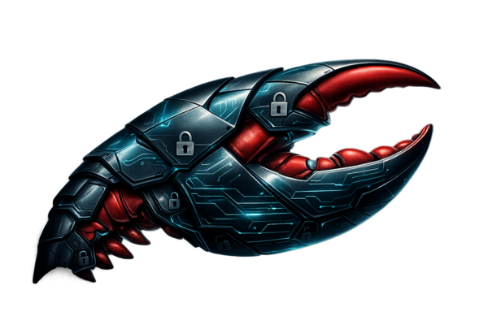

<p align="center">
  
</p>

<p align="center">
  <strong>SHELL UP. LOCK DOWN.</strong>
</p>

# Carapace — Webhook Armor for OpenClaw

**Carapace** is a hardened reverse proxy that sits in front of [OpenClaw](https://github.com/openclaw/openclaw)'s webhook endpoints.
It validates, rate-limits, and forwards only safe requests. The Gateway never touches the public internet — only Caddy is exposed.

If you expose OpenClaw webhooks to the internet, run them through Carapace.

## How it works

```
Internet ──► Caddy (TLS, :443) ──► Carapace (Bun, :3000) ──► OpenClaw (:18789)
```

The compose stack runs three services:

| Service | Image | Role |
|---|---|---|
| `caddy` | `caddy:2-alpine` | TLS termination, security headers, reverse proxy |
| `carapace` | `therealstein/carapace:1.0.2` | Auth, rate limiting, body validation, proxying |
| `openclaw` | `alpine/openclaw` | Gateway backend |

## Install (recommended)

All images are pulled from Docker Hub — no local build required.

```bash
cp .env.example .env
# Edit .env — set CARAPACE_TOKEN and OPENCLAW_HOOKS_TOKEN

docker compose up -d
```

That's it. Caddy auto-provisions TLS via Let's Encrypt when you set `DOMAIN`.

### Local dev (no Docker)

```bash
bun install
bun run src/index.ts
```

## OpenClaw (Docker)

Docker is optional. Use it only if you want a containerized gateway or to validate the Docker flow.

- **Yes** — you want an isolated, throwaway gateway environment or to run OpenClaw on a host without local installs.
- **No** — you're running on your own machine and just want the fastest dev loop. Use the local dev flow.

> Sandboxing note: agent sandboxing uses Docker too, but it does not require the full gateway to run in Docker. See [OpenClaw Sandboxing](https://github.com/openclaw/openclaw).

### Requirements

- Docker Desktop (or Docker Engine) + Docker Compose v2
- At least 512 MB RAM available for the stack

### Control UI (dashboard)

The OpenClaw Control UI is available via SSH tunnel — it is **not** exposed to the internet.

```bash
ssh -N -L 18789:127.0.0.1:18789 user@your-server
```

Then open `http://localhost:18789/` and paste the gateway token to connect.

Need the token again?

```bash
docker compose exec openclaw node dist/index.js dashboard --no-open
```

### Channel setup (optional)

```bash
# WhatsApp (QR)
docker compose exec openclaw node dist/index.js channels login

# Telegram
docker compose exec openclaw node dist/index.js channels add --channel telegram --token "<token>"

# Discord
docker compose exec openclaw node dist/index.js channels add --channel discord --token "<token>"
```

### Health check

```bash
docker compose exec openclaw node dist/index.js health --token "$OPENCLAW_GATEWAY_TOKEN"
```

### Persistent data

Config and workspace live in Docker volumes (`openclaw_config`, `openclaw_workspace`). Inspect:

```bash
docker volume inspect carapace_openclaw_config
```

### Permissions + EACCES

The `alpine/openclaw` image runs as `node` (uid 1000). If you see permission errors on `/home/node/.openclaw`, make sure your host bind mounts are owned by uid 1000:

```bash
sudo chown -R 1000:1000 /path/to/openclaw-config /path/to/openclaw-workspace
```

## Configuration

| Variable | Required | Default | Description |
|---|---|---|---|
| `CARAPACE_TOKEN` | Yes* | — | Bearer token for webhook auth |
| `OPENCLAW_HOOKS_TOKEN` | Yes | — | Token forwarded to OpenClaw |
| `OPENCLAW_GATEWAY_TOKEN` | Yes | — | OpenClaw gateway token (used for health checks) |
| `OPENCLAW_UPSTREAM` | No | `http://127.0.0.1:18789` | OpenClaw upstream URL |
| `DOMAIN` | No | `localhost` | Domain for Caddy TLS |
| `CARAPACE_HMAC_SECRET` | No | — | HMAC-SHA256 secret for signature verification |
| `RATE_LIMIT_MAX` | No | `30` | Max requests per window |
| `RATE_LIMIT_WINDOW_MS` | No | `60000` | Rate limit window in ms |
| `MAX_BODY_SIZE` | No | `65536` | Max request body size in bytes |
| `PROXY_TIMEOUT_MS` | No | `30000` | Upstream request timeout in ms |
| `LOG_LEVEL` | No | `info` | Log level: debug, info, warn, error |

\* At least one of `CARAPACE_TOKEN` or `CARAPACE_HMAC_SECRET` must be set.

## Auth modes

- **Token only** — set `CARAPACE_TOKEN`; requests need `Authorization: Bearer <token>`.
- **HMAC only** — set `CARAPACE_HMAC_SECRET`; requests need `x-openclaw-hmac-sha256` header.
- **Both** — set both; requests must pass both checks.

## Endpoints

| Method | Path | Description |
|---|---|---|
| `GET` | `/health` | Health check (no auth) |
| `POST` | `/hooks/wake` | Wake hook — requires `text` field |
| `POST` | `/hooks/agent` | Agent hook — requires `message` field |
| `POST` | `/hooks/:name` | Mapped hooks — pass-through with size limit |

## Deployment + DNS

Caddy auto-provisions TLS via Let's Encrypt. You just need a domain with a DNS record pointing to your server.

### Domain options

| Option | Cost | Notes |
|---|---|---|
| **Cloudflare Tunnel** | Free | No ports to open, no static IP needed. Outbound tunnel to Cloudflare's edge. |
| **DuckDNS** | Free | Dynamic DNS subdomain (`yourname.duckdns.org`). Good for home servers. |
| **Tailscale Funnel** | Free | Exposes via `*.ts.net`. Best for private/dev use. |
| **Porkbun / Cloudflare Registrar** | ~$2–10/yr | Cheap domains (`.xyz`, `.dev`, `.app`). Cloudflare sells at cost. |

### Own domain + DNS (production)

1. Buy a domain (e.g. `example.xyz` — Porkbun or Cloudflare Registrar).
2. Point nameservers to Cloudflare (free plan) or your registrar's DNS.
3. Add an `A` record:

   ```
   Type  Name  Content       TTL
   A     @     203.0.113.42  Auto
   ```

4. Set `DOMAIN=example.xyz` in `.env`.
5. Open ports **80** + **443** on your server.
6. `docker compose up -d` — Caddy obtains and renews certs automatically.

### Cloudflare Tunnel (free, no ports)

Use this if you can't open ports or don't have a static IP.

```bash
# Install cloudflared
curl -fsSL https://github.com/cloudflare/cloudflared/releases/latest/download/cloudflared-linux-amd64 \
  -o /usr/local/bin/cloudflared && chmod +x /usr/local/bin/cloudflared

# Auth + create tunnel
cloudflared tunnel login
cloudflared tunnel create carapace
```

Configure `~/.cloudflared/config.yml`:

```yaml
tunnel: <TUNNEL_ID>
credentials-file: ~/.cloudflared/<TUNNEL_ID>.json

ingress:
  - hostname: example.xyz
    service: http://localhost:443
  - service: http_status:404
```

Add a CNAME in Cloudflare DNS (`@ → <TUNNEL_ID>.cfargotunnel.com`), then:

```bash
cloudflared tunnel run carapace
```

### DuckDNS (free dynamic DNS)

1. Sign up at [duckdns.org](https://www.duckdns.org) — create a subdomain.
2. Auto-refresh your IP (crontab):

   ```bash
   echo url="https://www.duckdns.org/update?domains=YOURSUBDOMAIN&token=YOUR_DUCKDNS_TOKEN&ip=" | curl -k -o /dev/null -s -K -
   ```

3. Set `DOMAIN=yoursubdomain.duckdns.org` in `.env`.
4. Open ports **80** + **443** on your router/firewall.
5. `docker compose up -d`

### Firewall checklist

| Port | Protocol | Required by |
|---|---|---|
| 80 | TCP | Caddy — Let's Encrypt ACME HTTP-01 challenge |
| 443 | TCP + UDP | Caddy — HTTPS + HTTP/3 QUIC |

Ports 3000 (Carapace) and 18789 (OpenClaw) stay on the internal Docker network. Do **not** expose them.

> **Tip:** Lock down your firewall to only allow **22** (SSH), **80**, and **443** inbound. Drop everything else.

## Migrating from a local OpenClaw install

If you already run OpenClaw locally (not in Docker) and want to move it into the Carapace stack, paste this prompt into Claude Code:

```
SSH into <user>@<host> and migrate the existing local OpenClaw install into the
Carapace Docker stack:

1. Find the local OpenClaw data directory (usually ~/.openclaw)
2. Stop all running openclaw processes (kill -SIGTERM, then kill -9 if needed)
3. Create /opt/carapace with docker-compose.yml, Caddyfile, and .env from the repo
4. Set DOMAIN=<your-domain> in .env
5. Generate a CARAPACE_TOKEN and extract the gateway token from openclaw.json
6. docker compose create openclaw (to initialize volumes)
7. Copy local .openclaw/* into the openclaw_config volume, workspace into openclaw_workspace volume
8. Replace all hardcoded paths (e.g. /root/.openclaw) with /home/node/.openclaw in
   all .json and .jsonl files (find + sed -i)
9. Fix openclaw.json gateway config for Docker:
   - Set gateway.bind to "lan" (so Carapace can reach it over the Docker network)
   - Remove gateway.mode (local-only field, invalid in Docker)
   - Set gateway.controlUi.allowedOrigins to ["http://localhost:18789", "http://127.0.0.1:18789"]
     (required when bind is non-loopback; allows SSH tunnel access to the dashboard)
   - Update agents.defaults.workspace to /home/node/.openclaw/workspace
10. chown -R 1000:1000 on both volumes (container runs as node/uid 1000)
11. docker compose up -d
12. Uninstall the host-level OpenClaw (npm uninstall -g openclaw), kill any remaining
    host processes, but keep ~/.openclaw as a backup
13. Verify all three services are healthy, TLS cert is obtained, and test a webhook
```

## Security

- Bearer token + optional HMAC-SHA256 signature verification.
- Rejects `?token=` query params (400) — tokens belong in headers.
- Sliding window rate limiting with progressive IP lockout (3 auth failures → 5 min block).
- Body size limits (413 on oversized payloads).
- Schema validation per endpoint.
- Never logs request bodies or tokens.
- Runs as non-root user in Docker with read-only filesystem.
- Only Caddy is exposed to the internet.
